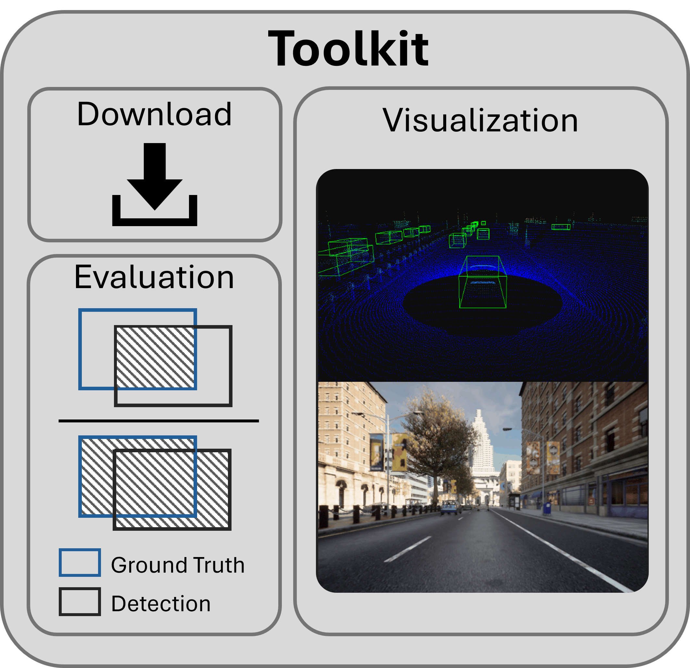
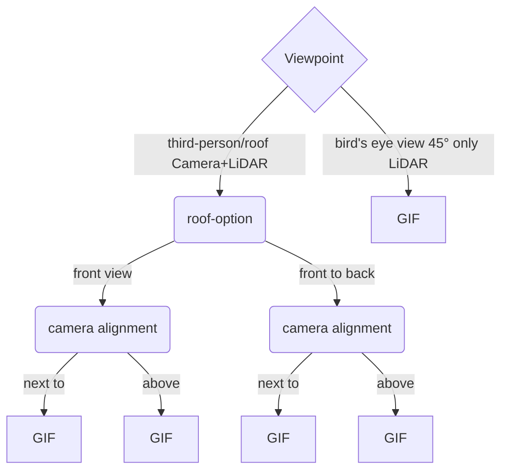
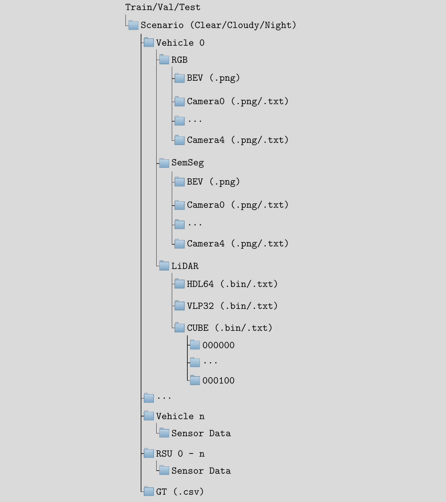
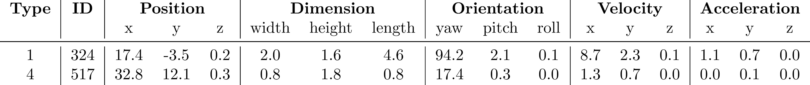

# Scope Dataset Website (Full Version available soon)


Here you can download the official Toolkit for the [SCOPE dataset](https://ekut-es.github.io/scope/).
The Toolkit provides functionality for an efficient parallel download, visualization and evaluation of Collective Perception Algorithms.



## Installation

Use the package manager [pip](https://pip.pypa.io/en/stable/) to install the Toolkit.

```bash
pip install scope-toolkit
```

## Usage
Once installed, you can start using the Toolkit to enhance your workflow with the SCOPE dataset. 

### Download

The Toolkit allows efficient parallel downloading and extraction into the correct structure of the SCOPE dataset.

Simply run 
```
cd ~/dataset-toolkit
python dataset-toolkit/TODO_ADD_PATH_TO/download_dataset.py
```
and follow the on-screen instructions.


### Visualization


The visualization module allows for an easy exploration of the dataset.

To visualize a scenario run
```
cd ~/dataset-toolkit
python dataset-toolkit/TODO_ADD_PATH_TO/visualize_sequence.py
```
and follow the on-screen instructions.
This will create a GIF of the selected scenario while following the selected car in the given scenario.

Currently there are a few different perspectives implemented. Those are



### Evaluation (TODO)
Evaluation module for easy and fair comparison of different methods using state-of-the-art metrics
TODO

## Data Structure
Our data structure optimises data management and analysis with unique features:

It separates environmental conditions, ensuring independent assessment of weather conditions. The hierarchical arrangement includes sensor data and transformation matrices per vehicle per scenario, enabling systematic management. Coordinate transformation is simplified with pre-existing matrices for each vehicle and sensor. In addition, support for common file formats such as .bin, .txt and .png ensures efficient data loading.



### Ground Truth Format (.csv)
This section outlines the structure and contents of the ground truth data stored in a CSV (Comma-Separated Values) format. The table provides an overview of the fields present in the CSV file.


Each column is a separate field, such as the following
```CSV
m_type << "," << m_id << "," << m_realworld_pos.x() << "," << m_realworld_pos.y() << "," << m_realworld_pos.z() << "," << m_realworld_dim.width <<...
```

The different types are

| Type ID | Description   |
|---------|---------------|
| 0       | BACKGROUND    |
| 1       | CAR           |
| 2       | VAN           |
| 3       | TRUCK         |
| 4       | PEDESTRIAN    |
| 5       | PERSON_SITTING|
| 6       | CYCLIST       |
| 7       | TRAM          |
| 8       | MISC          |
| 9       | MOTORBIKE     |

## Citation
If you use our SCOPE dataset or the toolkit, please use the following citation
